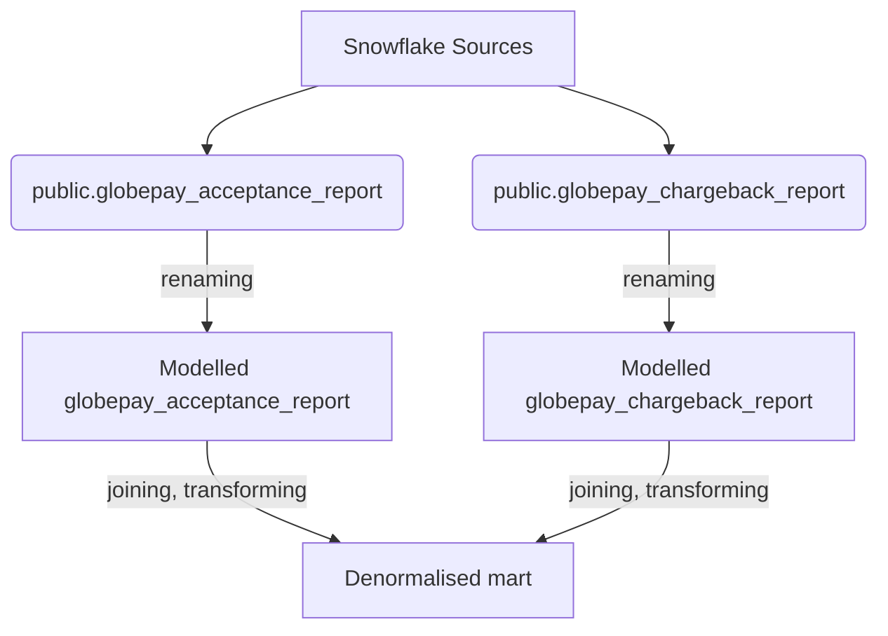

Read.me
See below for the simplified flow of the two data sources provided - Chargebacks and Acceptances. The sources are accessed through a connection to Snowflake, and freshness of the date_time transaction field is checked. The sources are then renamed and cleaned, with preventative casting and qualifying to maintain data integrity. The schema.yml file also specifies out-of-the-box tests to check the uniqueness/non-null quality of the primary keys and that the relation between the two sources exists. 
The two building blocks are then joined together to make a final denormalised mart for analyst use which brings together the transaction and chargeback data using the external_reference. 

`globepay_denormalised` is the final mart table which is incremental, which means that new entries from the source data are deleted and inserted based on the date specification. 
Column definitions:

| Column Name    | Definition |
| -------- | ------- |
| EXTERNAL_REF  | Primary key of the transaction, payment parameters (like amount, country, and currency) together with the input details collected from the customer    |
| REFERENCE | Identifcation field     |
| COUNTRY_CODE    | 2-Character code to identify the country of the transaction    |
| TRANSACTION_DATE    | Truncated Date of Transaction   |
| TRANSACTION_DATETIME    | Date and Timestamp of Transaction    |
| SOURCE    | GLOBEPAY   |
| TRANSACTION_STATE    | ACCEPTED or DENIED  |
| IS_ACCEPTED    | BOOLEAN field, transcation is accepted    |
| IS_CVV_PROVIDED    | BOOLEAN field, card verification provided by customer    |
| IS_ACCEPTED_CHARGEBACK    | BOOLEAN field, true if acceptance field is true from chargeback data source    |
| IS_CHARGEBACK    | BOOLEAN field, true if field is true from chargeback data source    |
| IS_MISSING_CHAREGBACK_DATA    | BOOLEAN field, true if the external_ref does not exist the chargeback data source    |
| CURRENCY_CODE    | 3-Character code to identify the currency    |
| TRANSACTION_AMOUNT_ORIGINAL    | Transaction amount in local currency    |
| TRANSACTION_AMOUNT_USD    | Transaction amount in USD    |
| TRANSACTION_AMOUNT_GBP    | Transaction amount in GBP      |
| TRANSACTION_AMOUNT_CAD    | Transaction amount in CAD      |
| TRANSACTION_AMOUNT_MXN    | Transaction amount in MXN      |
| TRANSACTION_AMOUNT_EUR    | Transaction amount in EUR      |
| LAST_UPDATED    | CURRENT_TIMESTAMP value of when the entry was last updated    |

